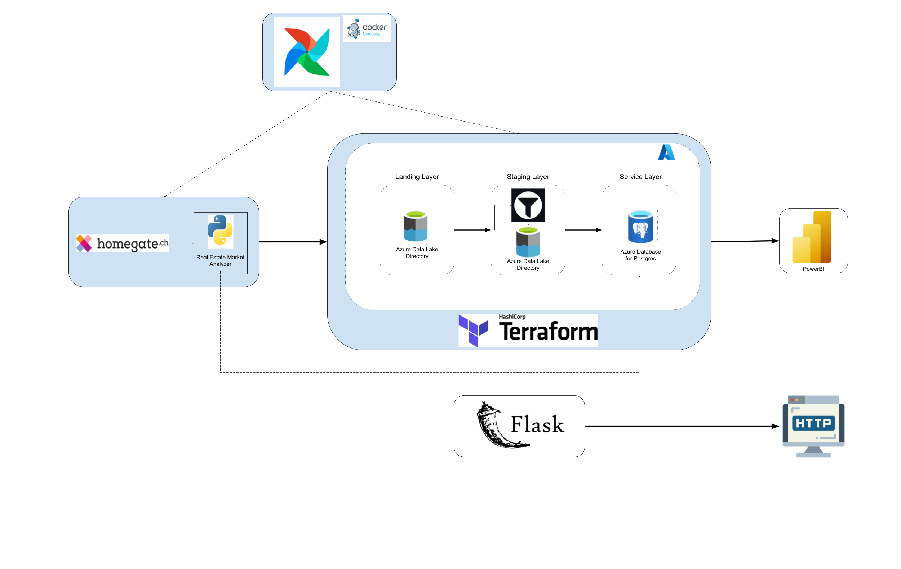
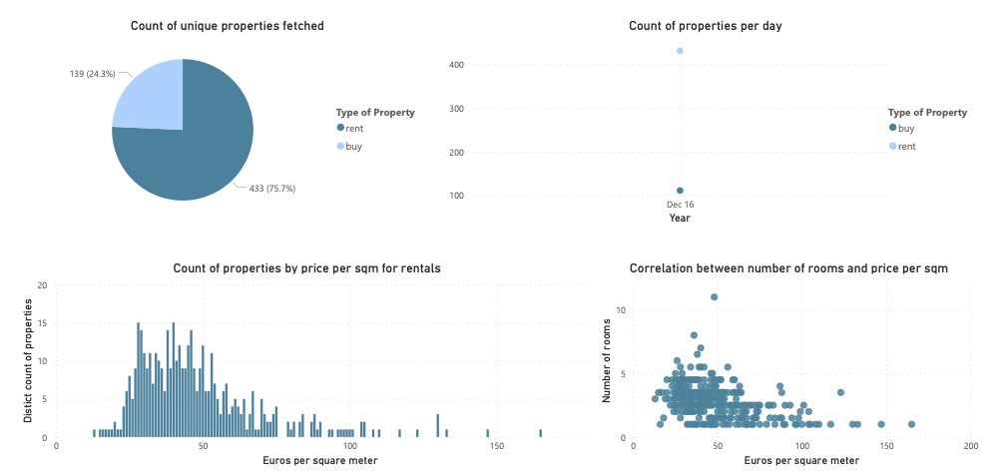
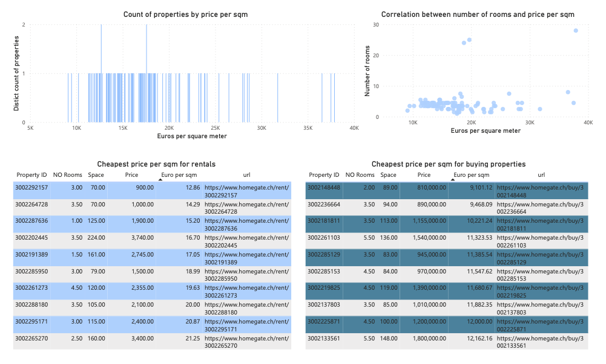

# Overview
Real Estate Market Analyzer is a proof-of-concept project that demonstrates a set of *Big Data Technologies* and how to use them. 

In general, this project focuses on collecting data from Switzerland's largest real estate marketplace (aka homegate.ch), storing it in Microsoft Azure, and finally displaying it in PowerBI. Furthermore, these data are accessible via an API, from which any app can retrieve data and initiate new searches.

# Architecture

The tools and technologies that have been utilized in this project are:

- **Airflow** as an orchestration tool to schedule the scraping jobs.
- **Azure Data Lake** as landing and staging zones.
- **Azure Database for PostgreSQL** as a service layer.
- **Docker** as a multicontainer infrastructure (Docker Compose) for hosting the Airflow instance.
- **Flask** in order to create an API that serves http requests.
- **PowerBI** as a data visualization tool.
- **Python** as the main programming language.
- **Pydantic** as a data validation library to verify the scraped data.
- **Terraform** as a tool for infrastructure management.

The infrastructure built to support the project's functionality is depicted in the figure below.

The data in this project is routed through a pipeline that can be triggered by airflow and the flask API.

### Airflow-activated pipeline:

- Airflow initiates a DAG that employs Real Estate Market Analyzer via a Python operator.
- Real Estate Market Analyzer scrapes property listings from homegate.ch, using zipcodes and usage type as inputs (that can be selling or rental properties).
- The data extracted from these listings is then saved in the Azure Data Lake in a directory called "Raw," because the data is raw scraped data.
- Furthermore, the data's quality and type are being validated using the pydantic library. The validated data is then stored in another directory of Azure Data Lake called staging.
- Finally, the data in the staging zone is appended to the Postgres Database, which serves as the service layer.
- A dashboard then incorporates these data into the service layer in order to present visually useful data to the user.

### Flask API:
The API makes use of the following two urls
|URL|Request Type| Arguments|
|---|---|---|
|`/scrape_location`| POST| zipcodes, usage_type|
|`/records`|POST| property_id, usage_type, space_min, space_max,        rooms,  europersqm_min, europersqm_max, price_min, price_max|

- When a POST requests is sent to the API's `/scrape_location` url, Flask executes the previously described pipeline using the request arguments.

- When a POST requests is sent to the API's `/records` url, the API uses the arguments to build a SQL query, which is then run against Postgres. Finally, the API returns the database data as a response.

# Instructions

### Deploy Azure Infrastructure
- Navigate into the terraform directory
- Run `terraform init` to initialize terraform.
- Run `terraform plan` in order to see the actions that terraform is about to follow.
- Run `terraform apply` in order to start the deployment.

### Deploy Airflow
- In order to deploy Airflow run `docker compose build` in order to build the application
- `docker compose up` to run the containers.
- Finally you can access the airflow UI on [localhost](http://localhost:8080/)
- Copy the DAG under `opt/airflow/dags` directory into airflow.
- Finally trigger the DAG or wait untill the next scheduled execution.

# Final PowerBI report
The figures extracted from PowerBI can help the user understand the Zurich housing market through the data that has been extracted from homegate.ch

